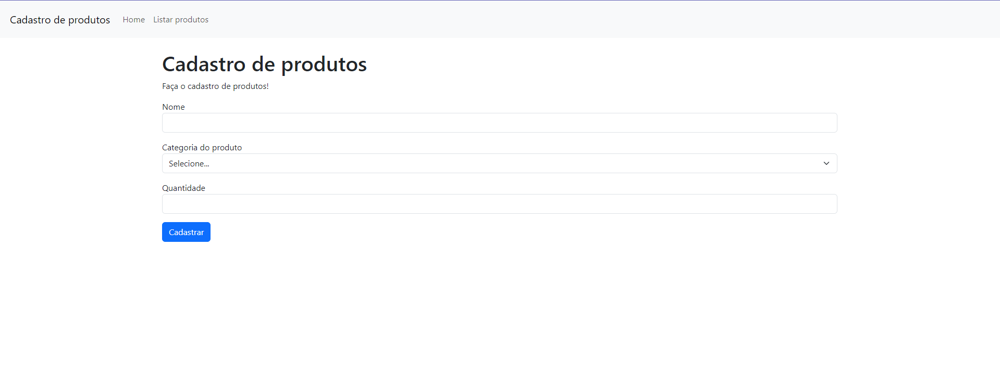

# Controle de estoque - loja 

Projeto feito durante os 100 dias de código com o intuito de treinar CRUD. Será feito um projeto pensando em um estoque de uma loja, com função de cadastrar produtos, deletar, atualizar e visualizar.

## Tela inicial 

## Tecnologias
  - Apache 
  - MySQL 
  - PHP 
  - HTML 
  - DBeaver como SGBD 
  - Bootstrap 

